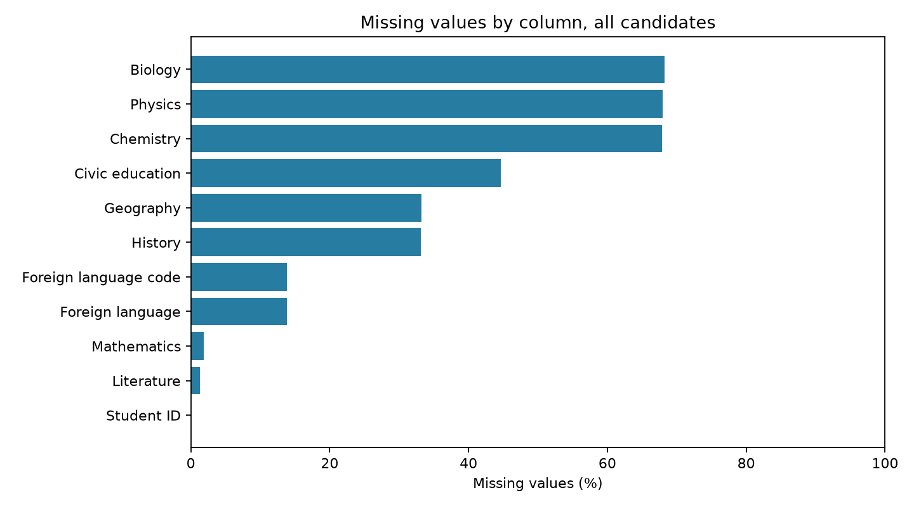
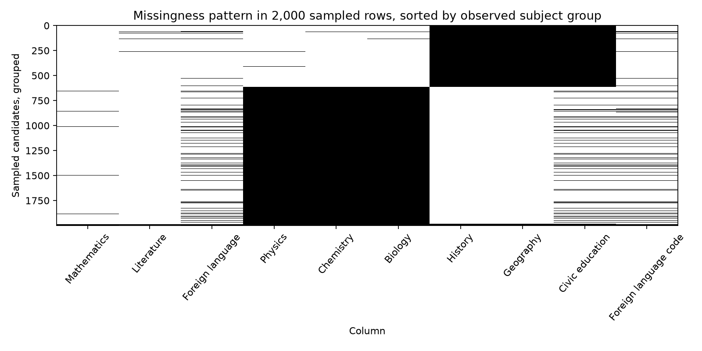
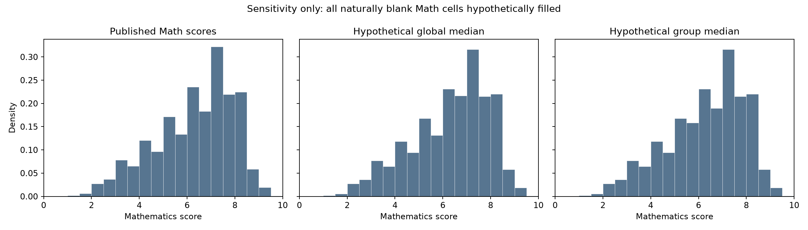
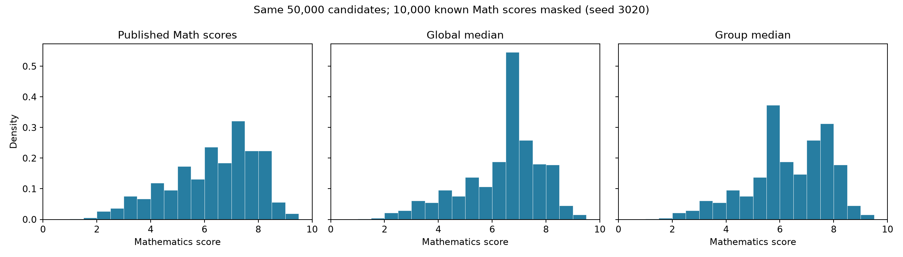

# INFO3020 Week 3 — Chất lượng và dữ liệu thiếu của điểm thi THPT 2023

**Nguồn và phạm vi.** Bài sử dụng tệp `data/raw/original.csv` của [bộ dữ liệu điểm thi THPT 2023 trên Kaggle](https://www.kaggle.com/datasets/duongtruongbinh/vietnamese-national-high-school-graduation-exam). SHA-256 của tệp khi chạy là `cdf22a6b45f8e23b522beb1c521782e36486cac39d3fb64bca2a2395edec39b5`. Có **1.022.060 dòng và 11 cột**: mã thí sinh, chín môn điểm, mã ngoại ngữ. Mục tiêu là đánh giá mức phù hợp của file để mô tả **điểm đã công bố của kỳ thi 2023**. Con số người dự thi trên trang giới thiệu nguồn không được dùng làm mẫu số thay cho số dòng CSV thực tế.

Yêu cầu bài tập được đối chiếu với slide 35 của `W3 - Data Quality and Processing_.pptx`; sáu chiều ở slide 7; tìm giá trị thiếu giả ở slide 13–15; cơ chế và cách xử lý ở slide 16–29; so sánh cách điền ở slide 32. Những ví dụ về `vn_jobs` trong slide là ví dụ phương pháp, không phải chỉ dẫn phải điền hết điểm thi.

## EX3.1 — Kiểm tra chất lượng dữ liệu

Thang 1–5 dưới đây là rubric đánh giá cho mục tiêu phân tích điểm đã công bố năm 2023: 5 = các phép kiểm liên quan đều tốt và có bằng chứng mạnh; 4 = tốt nhưng còn giới hạn nhỏ; 3 = dùng được có điều kiện; 2 = thiếu bằng chứng quan trọng hoặc có vấn đề lớn; 1 = chưa phù hợp mục tiêu. Điểm này là phán đoán có lập luận, không phải tỷ lệ phần trăm bản ghi chính xác. Sáu tiêu chí được đánh giá riêng; không tính một điểm tổng hợp tùy ý.

| Tiêu chí | Điểm | Bằng chứng chính | Giới hạn |
|---|---:|---|---|
| Completeness | **3/5** | Toán thiếu 18.687/1.022.060 (1,828%); Văn thiếu 13.821 (1,352%). Các môn tổ hợp thiếu nhiều nhưng pattern phụ thuộc nhóm điểm đã công bố. | Không có hồ sơ đăng ký hoặc miễn thi để xác định ô nào thực sự phải có điểm. |
| Accuracy | **2/5** | Có nguồn CSV và các phép kiểm nội bộ, nhưng không có bảng điểm chính thức độc lập để đối soát điểm từng thí sinh. | Điểm hợp lệ về định dạng vẫn có thể là điểm ghi sai. |
| Consistency | **4/5** | Không có dòng nào mà điểm Ngoại ngữ có nhưng mã thiếu hoặc ngược lại; không có dòng có điểm ở cả hai nhóm tổ hợp. | Các pattern môn chưa đầy đủ cần metadata để diễn giải. |
| Validity | **5/5** | Chín cột điểm có 0 giá trị ngoài [0,10] hoặc vô hạn; 0 mã ngoại ngữ ngoài N1–N7; 0 Student ID có dữ liệu sai định dạng tám chữ số. | Tập mã N1–N7 dựa trên tài liệu/mapping của dataset, chưa đối chiếu văn bản quy chế chính thức. |
| Uniqueness | **5/5** | 0 Student ID trùng, 0 toàn dòng trùng trong 1.022.060 bản ghi. | Kết luận dựa trên giả định Student ID là định danh thí sinh trong CSV này. |
| Timeliness | **4/5** | Dữ liệu mô tả kỳ thi 2023, phù hợp câu hỏi nghiên cứu về điểm năm 2023. | File không có thời điểm thu thập hoặc sửa theo từng thí sinh; không đại diện trực tiếp cho kỳ thi năm khác. |

**Completeness theo mục đích sử dụng.** Tỷ lệ thiếu trên toàn bảng là 67,987% ở Vật lý, 67,896% ở Hóa, 68,238% ở Sinh; 33,130% ở Sử, 33,259% ở Địa và 44,675% ở GDCD. Đây không phải tỷ lệ “hỏng dữ liệu”: kỳ thi có hai bài tổ hợp khác nhau. Có 329.430 thí sinh có ít nhất một điểm tự nhiên và không có điểm xã hội; 683.813 có ít nhất một điểm xã hội và không có điểm tự nhiên; 8.817 không thấy điểm ở cả hai nhóm; 0 có điểm ở cả hai. Do đó, không dòng nào đủ cả **9** điểm, nhưng trong 1.013.243 dòng có thể suy ra một nhóm từ điểm quan sát, **872.976** dòng đủ cả **6** môn liên quan theo nhóm đó. Một điểm trong nhóm **không chứng minh** thí sinh đã đăng ký cả ba môn nhóm đó. Nhóm 8.817 cần điều tra riêng; 4.476 dòng chỉ còn Student ID, chưa thể suy ra nguyên nhân.

**Các phép kiểm đã chạy.** Mã thí sinh được đọc dưới dạng chuỗi; mẫu đầu `01000001` giữ số 0 đầu. CSV được quét token trước khi pandas chuẩn hóa: các ô thiếu đang biểu diễn bằng ô trắng; không thấy token bất thường thuộc danh sách kiểm tra như `-`, `N/A`, `NULL`, `?`, `-999` hoặc `9999`. Điểm 0 được xem là hợp lệ; các điểm quan sát có min 0 và max 10 ở từng môn. Các mã ngoại ngữ quan sát thuộc N1–N7 theo mapping đi kèm dự án. Những kiểm tra này hỗ trợ validity và consistency. Chúng không thay cho kiểm tra accuracy bằng dữ liệu độc lập.

**Tính nhất quán giữa các cột.** Cặp điểm Ngoại ngữ và mã ngoại ngữ thiếu cùng nhau ở 141.063 dòng, còn 880.997 dòng có cả hai. Đây là dấu hiệu quá trình ghi nhận chung, chưa nói được vì sao từng thí sinh thiếu Ngoại ngữ. Trong nhóm có ít nhất một điểm xã hội, **118.361 dòng** không có GDCD, tương đương **17,309%** nhóm đó. Cần thông tin đăng ký và loại thí sinh để phân biệt môn không áp dụng, miễn thi, vắng thi và lỗi ghi nhận. Tương tự, có 2.241 dòng trong nhóm tự nhiên thiếu Lý, 1.312 thiếu Hóa và 4.805 thiếu Sinh; không thể tự động coi đây là dữ liệu mất. Bảng pattern và phân loại ô thiếu chi tiết ở EX3.2.

**Đánh giá giới hạn.** Bộ dữ liệu đủ nhất quán để mô tả phân phối **các điểm hiện có** theo từng môn, với mẫu số công khai cho mỗi thống kê. Không nên nói trung bình những điểm đã công bố là trung bình của toàn bộ 1.022.060 thí sinh ở một môn tự chọn. Nếu cần xác thực từng điểm hoặc đánh giá những người vắng/miễn thi, phải đối chiếu bảng điểm và hồ sơ dự thi từ nguồn có thẩm quyền. Cách phân biệt validity, accuracy và timeliness này bám đúng định nghĩa ở slide 7.

Số đếm chi tiết có trong `outputs/tables/column_profile+ho_so_cot.csv`; điểm audit, bốn nhóm điểm quan sát và bảng thiếu theo ngữ cảnh có trong `outputs/metrics+chi_so.json`.

## EX3.2 — Cơ chế thiếu và cách xử lý

MCAR là xác suất thiếu không phụ thuộc thông tin liên quan; MAR là xác suất thiếu có thể giải thích bằng các biến đã quan sát khi điều kiện hóa; MNAR còn phụ thuộc thông tin chưa quan sát. Theo slide 18, nhãn cơ chế không thể suy ra từ bảng số liệu một mình. Ô trống vì môn không được thi là trường hợp **không áp dụng theo thiết kế**; cần tách khỏi ba cơ chế của một giá trị lẽ ra tồn tại. Dataset không có đăng ký môn, tình trạng miễn/vắng thi hoặc nhật ký thu thập, nên các nhãn sau là giả thuyết vận hành.

**Hai lớp ô trống.** Với thí sinh có ít nhất một điểm tự nhiên mà không thấy điểm xã hội, ba ô xã hội trống là *ứng viên không áp dụng theo cấu trúc*; chiều ngược lại tương tự. Đây là nhãn dựa trên pattern, **chưa phải xác nhận đăng ký thi của cá nhân**. Điểm trống trong chính nhóm quan sát, cũng như Toán, Văn, Ngoại ngữ, được để ở lớp *chưa xác định nguyên nhân*; chúng có thể bao gồm không áp dụng, miễn/vắng thi hoặc lỗi ghi nhận. Cả sáu môn tổ hợp của nhóm không thấy điểm ở hai phía đều chưa phân loại được. MCAR/MAR/MNAR chỉ có ý nghĩa nếu giả sử điểm lẽ ra tồn tại; structural missing đúng nghĩa nằm ngoài ba cơ chế ấy. Khác biệt về tỷ lệ thiếu theo nhóm làm giả thuyết MCAR chung kém hợp lý, nhưng không chứng minh MAR hay loại trừ MNAR.

**Hai mẫu số, hai câu hỏi.** Trên toàn CSV, đếm số điểm trống trong cả 9 cột điểm cho kết quả sau. Mỗi dòng được đếm một lần; mã ngoại ngữ không tính là một môn. Việc không có dòng nào thiếu 0–2 môn là hệ quả dễ thấy của hai tổ hợp thi khác nhau, không phải bằng chứng mọi dòng bị lỗi.

| Số điểm thiếu trong 9 môn | 0–2 | 3 | 4 | 5 | 6 | 7 | 8 | 9 |
|---|---:|---:|---:|---:|---:|---:|---:|---:|
| Số dòng | 0 | 872.976 | 13.763 | 105.884 | 23.898 | 610 | 453 | 4.476 |

Trong phân tích chính, chỉ với 1.013.243 dòng có điểm ở **đúng một** nhóm tổ hợp quan sát, đếm ô trống trong Toán, Văn, Ngoại ngữ và ba môn của nhóm đó. Đây là sáu cột *liên quan để xem pattern*, chưa khẳng định cả sáu môn đều bắt buộc cho từng người. Riêng GDCD có thể không áp dụng với thí sinh GDTX. Không đưa 8.817 dòng chưa thấy điểm tổ hợp vào mẫu số của bảng này.

| Nhóm quan sát | Thiếu 0 | Thiếu 1 | Thiếu 2 | Thiếu 3–4 | Thiếu 5+ | Tổng |
|---|---:|---:|---:|---:|---:|---:|
| Tự nhiên | 313.095 | 7.850 | 2.241 | 6.239 | 5 | 329.430 |
| Xã hội | 559.881 | 5.913 | 103.643 | 14.372 | 4 | 683.813 |

**Mẫu môn thiếu cụ thể.** Trong nhóm xã hội, **102.712** dòng thiếu đúng *Ngoại ngữ + GDCD* trong sáu cột liên quan; **12.690** dòng thiếu *Toán + Ngoại ngữ + GDCD*. Trong nhóm tự nhiên, mẫu thiếu đúng *Văn + Ngoại ngữ* có **1.665** dòng, còn *Văn + Ngoại ngữ + Sinh* có **3.019** dòng. File `outputs/tables/context_missing_subject_patterns+mau_mon_thieu.csv` liệt kê **mọi** tổ hợp quan sát được, kể cả các cặp hiếm và tổ hợp 3–4 môn; các nhóm ở bảng trên là tổng của những dòng pattern tương ứng. Những đồng xuất hiện này không tự chỉ ra nguyên nhân từng ô.

Trong 8.817 dòng không có điểm tự nhiên hoặc xã hội, **4.476 chỉ có Student ID**, còn 4.341 vẫn có ít nhất một điểm Toán, Văn hoặc Ngoại ngữ. Nhóm chỉ còn ID phải kiểm tra hồ sơ nguồn; không thể gán MCAR, MAR, MNAR hay kết luận không dự thi từ CSV này.

**Phân rã từng cột.** “Ứng viên cấu trúc” là ô trống trong nhóm chỉ có điểm của tổ hợp đối diện. “Chưa rõ: cùng nhóm” là ô trống ở người đã có ít nhất một điểm trong tổ hợp của cột, hoặc ở hai nhóm quan sát đối với môn độc lập. “Chưa rõ: không nhóm” là ô trống ở 8.817 dòng không thấy tổ hợp. Ba số ở từng hàng cộng lại bằng tổng thiếu; mã Ngoại ngữ được báo cáo riêng vì là biến phân loại, không tính vào chín môn điểm.

| Cột | Tổng thiếu | Ứng viên cấu trúc | Chưa rõ: cùng nhóm | Chưa rõ: không nhóm |
|---|---:|---:|---:|---:|
| Toán | 18.687 | 0 | 13.800 | 4.887 |
| Văn | 13.821 | 0 | 9.063 | 4.758 |
| Ngoại ngữ | 141.063 | 0 | 135.940 | 5.123 |
| Lý | 694.871 | 683.813 | 2.241 | 8.817 |
| Hóa | 693.942 | 683.813 | 1.312 | 8.817 |
| Sinh | 697.435 | 683.813 | 4.805 | 8.817 |
| Sử | 338.613 | 329.430 | 366 | 8.817 |
| Địa | 339.926 | 329.430 | 1.679 | 8.817 |
| GDCD | 456.608 | 329.430 | 118.361 | 8.817 |
| Mã Ngoại ngữ | 141.063 | 0 | 135.940 | 5.123 |

Theo [thông tin kỳ thi 2023 của Chính phủ](https://media.chinhphu.vn/chinh-thuc-cong-bo-lich-thi-tot-nghiep-thpt-nam-2023-102230407203353316.htm), bài KHXH có Sử, Địa, GDCD với chương trình THPT nhưng chỉ có Sử, Địa với chương trình GDTX. Điều này làm giả thuyết GDCD *không áp dụng* có cơ sở, ngay cả trong nhóm xã hội. Trong nhóm xã hội thiếu GDCD, **116.811/118.361 (98,690%)** cũng thiếu Ngoại ngữ; ở nhóm có GDCD, chỉ **5.213/565.452 (0,922%)** thiếu Ngoại ngữ. [Hướng dẫn đăng ký thi 2023](https://baochinhphu.vn/chi-tiet-cach-ghi-phieu-dang-ky-du-thi-tot-nghiep-thpt-2023-102230407191450234.htm) cho biết thí sinh GDTX có thể chọn thi Ngoại ngữ để xét tuyển; [hướng dẫn miễn thi Ngoại ngữ](https://baochinhphu.vn/truong-hop-nao-duoc-mien-thi-ngoai-ngu-thpt-2023-102230416185154874.htm) cho thấy miễn thi cũng là một khả năng. Mối liên hệ GDCD–Ngoại ngữ là **bằng chứng gợi ý**, không đủ để gắn nhãn GDTX hay miễn thi cho từng người.

| Cột | Thiếu n (%) | Cơ chế khả dĩ và bằng chứng | Cách xử lý đã chọn; lý do |
|---|---:|---|---|
| Mathematics | 18.687 (1,828%) | Chưa xác định MCAR/MAR/MNAR. Thiếu 33/329.430 ở nhóm tự nhiên, 13.767/683.813 ở nhóm xã hội, 4.887/8.817 ở nhóm không thấy điểm tổ hợp. Khác biệt lớn theo nhóm quan sát, nhưng không chứng minh MAR. | Giữ null; thống kê điểm Toán đã công bố với n. Thiếu hồ sơ dự thi để xác nhận một điểm có tồn tại. |
| Literature | 13.821 (1,352%) | Chưa xác định. Thiếu 8.838 ở nhóm tự nhiên, 225 ở nhóm xã hội và 4.758 ở nhóm không thấy điểm tổ hợp. | Giữ null; không loại mọi dòng thiếu Văn khỏi phân tích các môn khác. |
| Foreign language | 141.063 (13,802%) | Trạng thái thiếu trùng hoàn toàn với mã Ngoại ngữ; quá trình tham dự, miễn thi và ghi nhận chưa biết. | Giữ null; không đoán điểm từ môn khác. |
| Physics | 694.871 (67,987%) | 683.813 thuộc nhóm chỉ có điểm xã hội, phù hợp giả thuyết không áp dụng; 8.817 không thấy tổ hợp; 2.241 có ít nhất một điểm tự nhiên. | Giữ null; tách các ngữ cảnh khi đọc tỷ lệ thiếu. |
| Chemistry | 693.942 (67,896%) | Tương ứng: 683.813 nhóm xã hội; 8.817 nhóm không thấy tổ hợp; 1.312 có điểm tự nhiên khác. | Giữ null; không tạo điểm Hóa khi không xác nhận có bài thi. |
| Biology | 697.435 (68,238%) | Tương ứng: 683.813 nhóm xã hội; 8.817 nhóm không thấy tổ hợp; 4.805 có điểm tự nhiên khác. | Giữ null; không suy ra điểm Sinh từ Lý/Hóa. |
| History | 338.613 (33,130%) | 329.430 nhóm chỉ có điểm tự nhiên; 8.817 nhóm không thấy tổ hợp; 366 có điểm xã hội khác. | Giữ null; mẫu số phù hợp tùy câu hỏi phân tích. |
| Geography | 339.926 (33,259%) | Tương ứng: 329.430 nhóm tự nhiên; 8.817 nhóm không thấy tổ hợp; 1.679 có điểm xã hội khác. | Giữ null; kiểm tra hồ sơ trước khi gắn nhãn lỗi. |
| Civic education | 456.608 (44,675%) | 329.430 nhóm tự nhiên; 8.817 nhóm không thấy tổ hợp; **118.361** có điểm xã hội khác. Loại thí sinh và đăng ký có thể liên quan, chưa xác minh. | Giữ null; đây là vấn đề cần điều tra riêng, không tự động điền median. |
| Foreign language code | 141.063 (13,802%) | Thiếu đúng cùng 141.063 dòng với điểm Ngoại ngữ; cơ chế cụ thể chưa biết. | Giữ null; mã N1 phổ biến không phải lý do để gán N1 cho người thiếu. |

`Student ID` không có missing nên không thuộc bảng. Cột `observed_exam_group` chỉ mô tả điểm có trong CSV, không biểu thị đăng ký thi đã được xác nhận. Những con số “thuộc nhóm đối diện” là bằng chứng gợi ý structural missing, không phải bằng chứng thí sinh chắc chắn không dự thi môn đó. Các nhánh “<5% MCAR có thể drop” hay “>60% có thể bỏ cột” ở slide 20 đều có điều kiện về cơ chế và mục tiêu phân tích. Áp dụng máy móc sẽ xóa môn tự chọn hoặc tạo điểm thi chưa từng tồn tại.

**Quy tắc sử dụng null.** Phân phối một môn dùng các dòng có điểm môn ấy và công bố `n`; tương quan hai môn dùng các dòng đủ **cả hai** điểm và công bố số cặp; tổng điểm của một tổ hợp chỉ tính với dòng đủ tất cả môn cần cho tổng đó. Một dòng thiếu môn khác vẫn có thể dùng cho phân tích mà nó đủ dữ liệu. Không chạy `dropna()` trên toàn bộ 11 cột: làm vậy sẽ xóa hết dòng vì mỗi người đều thiếu ít nhất ba môn trong bảng thô. Nếu cần diễn giải tỷ lệ *điểm bắt buộc bị thiếu*, phải đối chiếu hồ sơ đăng ký, chương trình học, miễn/vắng thi và bản ghi điểm có thẩm quyền trước.

File `data/processed/exam_2023.parquet` giữ 11 cột và các giá trị thiếu. Bảng xử lý máy đọc được ở `outputs/tables/missing_treatment+cach_xu_ly_thieu.csv`; bảng đếm 9 môn, 6 môn, pattern cụ thể và phân loại ô thiếu nằm trong `outputs/tables/`, đồng thời được đối chiếu trong `outputs/metrics+chi_so.json`.

## EX3.3 — So sánh Global Median và Group Median trên điểm Toán

**So sánh trực tiếp trên những ô Toán đang thiếu, dưới dạng phân tích nhạy cảm.** Có 18.687 ô Toán trống. Giả sử tất cả đều là điểm đã tồn tại nhưng chưa được ghi nhận, điền thử theo hai cách trên *bản sao trong bộ nhớ*: A dùng trung vị chung **6,6** của 1.003.373 điểm Toán quan sát; B dùng trung vị **7,6** ở nhóm có điểm tự nhiên và **5,8** ở nhóm có điểm xã hội. Với 4.887 dòng không thấy điểm tổ hợp, B dùng trung vị chung 6,6. Phân nhóm dựa vào điểm tổ hợp, không dùng điểm Toán. Giả định “điểm thật có tồn tại” hiện **chưa được xác minh**. Không xuất các điểm thử này vào Parquet.

Trong bảng, `n` là số điểm Toán có giá trị; độ lệch chuẩn là độ lệch chuẩn mẫu (`ddof=1`). Ba hàng cùng dựa trên 1.022.060 thí sinh; hàng đầu chưa điền 18.687 ô trống.

| Trạng thái | n | Mean | Std |
|---|---:|---:|---:|
| Điểm đã công bố | 1.003.373 | 6,2506 | 1,6333 |
| Giả định điền Global Median | 1.022.060 | 6,2569 | 1,6190 |
| Giả định điền Group Median | 1.022.060 | 6,2462 | 1,6194 |

Hai cách cùng điền 18.687 ô nhưng đưa mean sang hai hướng khác nhau: A tăng khoảng 0,0064 điểm, B giảm khoảng 0,0044 điểm so với các điểm quan sát. Cả hai làm std giảm khoảng 0,014 điểm. Mức thay đổi toàn bảng nhỏ vì chỉ 1,828% Toán thiếu; điều đó không làm các điểm điền trở thành điểm thật. Global Median tạo thêm khối giá trị tại 6,6; Group Median thêm khối ở 5,8 và 7,6, cùng một fallback tại 6,6. Hình dùng bin 0,5 điểm và cùng thang trục để đối chiếu.

**Thử nghiệm có điểm thật để kiểm tra phương pháp.** Để đo được sai số, lấy mẫu ngẫu nhiên 50.000 từ 1.003.373 dòng có điểm Toán (seed 3020), che 10.000 điểm Toán đã biết, rồi điền đúng các ô đó bằng A và B. Trung vị được học chỉ từ 40.000 điểm chưa che: chung **6,6**; tự nhiên **7,6** từ 13.125 điểm donor; xã hội **5,8** từ 26.745 điểm donor. Trong 10.000 ô che, B dùng group median cho 9.958 ô và fallback cho 42 ô thuộc nhóm không thấy điểm tổ hợp. Hai phương pháp dùng cùng mẫu, cùng mask và cùng donor; điểm bị che chỉ được dùng sau khi điền để đánh giá.

| Trạng thái trong thí nghiệm | n | Mean | Std | MAE trên 10.000 ô che | RMSE trên 10.000 ô che |
|---|---:|---:|---:|---:|---:|
| Điểm gốc trước khi che | 50.000 | 6,2564 | 1,6276 | — | — |
| Sau khi che, chưa điền | 40.000 | 6,2562 | 1,6283 | — | — |
| Global Median | 50.000 | 6,3250 | 1,4629 | 1,3166 | 1,6605 |
| Group Median | 50.000 | 6,2843 | 1,5057 | 1,1006 | 1,3958 |

Trong phép che ngẫu nhiên này, B có MAE thấp hơn A **0,2159 điểm** và RMSE thấp hơn **0,2647 điểm**. B giữ mean gần mẫu gốc hơn (chênh +0,0279 so với +0,0686), nhưng vẫn làm std giảm 0,1219 và tạo các đỉnh lặp trong phân phối. Đây là kết quả của mẫu và cơ chế che nhân tạo gần MCAR. Chưa thể suy từ đó rằng B sẽ khôi phục đúng 18.687 điểm Toán vốn trống, vì những thí sinh thiếu thật có thể khác người được che ngẫu nhiên. Bảng nhạy cảm và thí nghiệm đều cho thấy lựa chọn điền ảnh hưởng thống kê; chúng không thay quyết định giữ null ở EX3.2.

Chi tiết chưa làm tròn: `outputs/tables/natural_missing_sensitivity+do_nhay_thieu_tu_nhien.csv`, `outputs/tables/imputation_comparison+so_sanh_dien_khuyet.csv` và `outputs/metrics+chi_so.json`.

## Kết luận

CSV phù hợp để mô tả điểm thi **đã được công bố** năm 2023 theo từng môn với mẫu số rõ ràng. Các phép kiểm hiện tại không thấy điểm ngoài miền, mã lạ, ID trùng hoặc cặp điểm/mã Ngoại ngữ lệch trạng thái. Vấn đề chưa giải quyết là nguyên nhân của từng ô trống và độ chính xác của từng điểm so với nguồn chính thức. Cần dữ liệu đăng ký môn, miễn thi, vắng thi và nguồn điểm độc lập trước khi phân loại chắc chắn MCAR/MAR/MNAR hoặc tạo điểm phục hồi. Bộ dữ liệu chính tiếp tục giữ null để Week 4 xử lý các vấn đề chất lượng khác trên nền dữ liệu có nguồn gốc rõ ràng.
