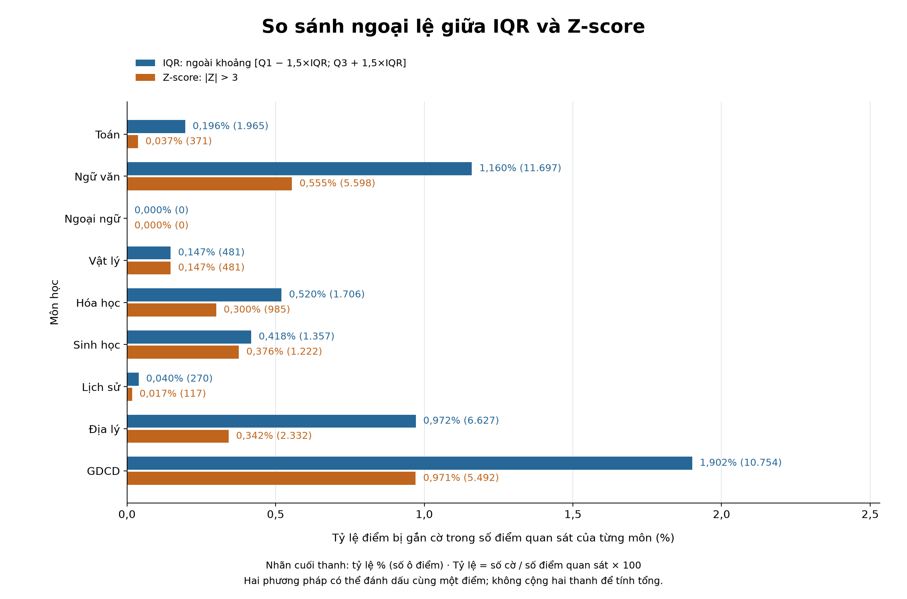
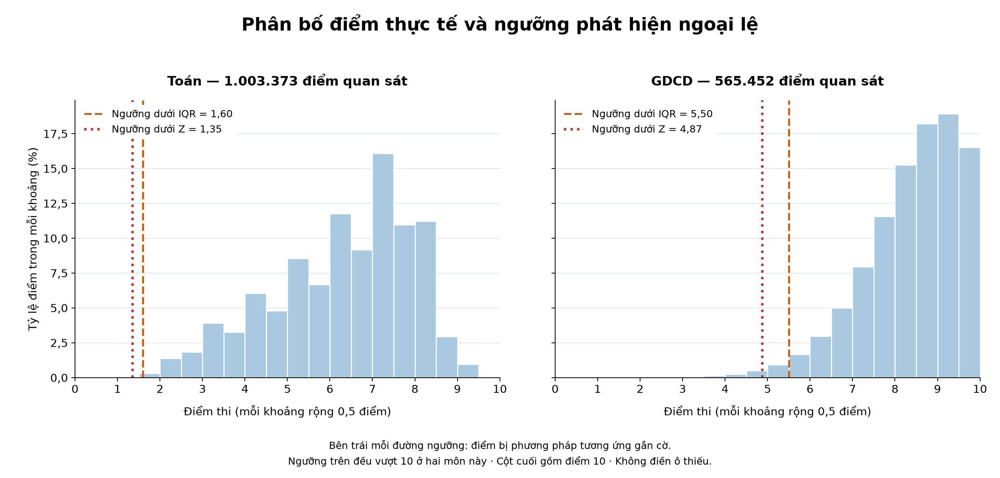
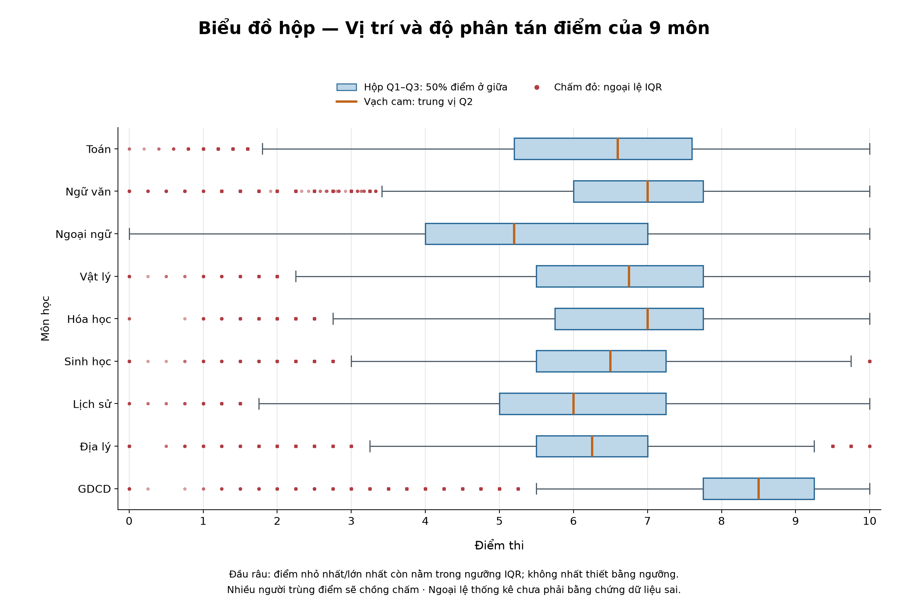

# INFO3020 Week 4 — Data Cleaning

## Dữ liệu và cách tái lập

Phân tích **1,022,060 dòng, 11 cột** của điểm thi THPT 2023. CSV gốc được giữ nguyên;
SHA-256: `cdf22a6b45f8e23b522beb1c521782e36486cac39d3fb64bca2a2395edec39b5`. Nguồn được ghi nhận từ
[dataset Kaggle](https://www.kaggle.com/datasets/duongtruongbinh/vietnamese-national-high-school-graduation-exam).
Số đếm thực tế của CSV được dùng làm mẫu số thay cho mô tả 1,5 triệu trong Data Card.
Chưa tải lại tệp Kaggle để đối chiếu hash, nên chuỗi nguồn xa hơn tệp CSV địa phương vẫn có giới hạn.

Chạy `python -m src.analyze_week4`, sau đó `python -m src.build_week4_notebook` bằng Python của `.venv`.
Notebook xây lại pipeline trên toàn bộ dữ liệu, không cần mạng. Ngày kiểm tra web được giữ riêng trong
[nhật ký nguồn](week4_source_checks.json), không đổi thành ngày chạy lại.
Hạn: **23:59 ngày trước buổi Week 5**; chưa có ngày học cụ thể.

## EX4.1 — Hai phương pháp phát hiện ngoại lệ

Mỗi môn sử dụng toàn bộ điểm không thiếu. IQR = Q3 − Q1; Q1/Q3 nội suy tuyến tính.
Ngoại lệ khi x < Q1 − 1,5×IQR hoặc x > Q3 + 1,5×IQR, dùng bất đẳng thức nghiêm ngặt.
Z = (x − μ)/σ với `ddof=0`; ngưỡng |Z| > 3. ID và mã ngoại ngữ không phải biến số đo.
Cột toàn thiếu không gắn cờ; σ = 0 làm Z không xác định; IQR = 0 vẫn dùng đúng hai hàng rào suy biến.

### Giải nghĩa và cách tính

**Ngoại lệ (outlier)** là giá trị nằm xa phần lớn điểm của cùng môn theo một quy tắc thống kê.
**Gắn cờ** là đánh dấu để điều tra, chưa phải kết luận dữ liệu sai.

| Ký hiệu / thuật ngữ | Ý nghĩa và cách tính |
| --- | --- |
| x | Một điểm thi cần kiểm tra, ví dụ điểm GDCD của một thí sinh. |
| n | Số điểm **không thiếu của môn đang xét**; mỗi môn có n khác nhau. |
| Q1, Q2, Q3 | Các mốc phân vị 25%, 50%, 75% của dãy điểm đã sắp xếp. Q2 là trung vị. |
| IQR = Q3 − Q1 | Độ rộng khoảng chứa 50% dữ liệu ở giữa; đo độ phân tán của phần trung tâm. |
| L = Q1 − 1,5 × IQR; U = Q3 + 1,5 × IQR | Ngưỡng dưới và trên của phương pháp IQR. Gắn cờ nếu x < L hoặc x > U. |
| μ = Σxᵢ / n | Trung bình: tổng các điểm quan sát chia cho số điểm quan sát. |
| σ = √[Σ(xᵢ − μ)² / n] | Độ lệch chuẩn tổng thể: bình phương độ lệch so với trung bình, lấy trung bình rồi căn bậc hai. `ddof=0` nghĩa là chia cho n. |
| Z = (x − μ) / σ | Khoảng cách từ x tới trung bình, tính bằng số lần độ lệch chuẩn. Z âm: thấp hơn trung bình; Z dương: cao hơn trung bình. |
| abs_z = trị tuyệt đối của Z | Bỏ dấu để so sánh độ lệch ở cả hai phía. Ngưỡng gắn cờ là abs_z > 3. |

**Nội suy tuyến tính khi tính phân vị:** sắp xếp n điểm thành x₀,…,xₙ₋₁. Với phân vị p,
tính h = (n−1)×p, k = phần nguyên của h, d = h−k. Nếu d=0 thì Q(p)=xₖ;
nếu d>0 thì Q(p)=xₖ+d×(xₖ₊₁−xₖ). Dùng p=0,25 để lấy Q1 và p=0,75 để lấy Q3.
Đây là quy ước `interpolation='linear'` của phép tính trong bài.

**Vì sao hai phương pháp khác nhau?** IQR dựa vào các phân vị ở giữa; Z-score dùng trung bình
và độ lệch chuẩn của toàn bộ điểm quan sát. Với phân phối lệch, hai cách có thể đặt ngưỡng khác nhau.
Ngưỡng 1,5 và 3 là quy tắc phát hiện trong bài, không phải xác suất một điểm bị nhập sai.
Không cần ép phân phối điểm thành hình chuông; histogram sẽ thể hiện phân phối thực tế.

Ô thiếu được bỏ khỏi phép tính thống kê, không thay bằng 0. Điểm đúng tại ngưỡng không bị gắn cờ.
Nếu σ=0 thì tất cả điểm quan sát bằng nhau và Z không xác định; nếu IQR=0 vẫn áp dụng khoảng
ngưỡng suy biến. Số hiển thị được làm tròn; chương trình so sánh bằng giá trị chưa làm tròn.

### Ví dụ thay số từ dữ liệu thật

**IQR môn Toán:** Q1 = 5,2, Q3 = 7,6.
IQR = 7,6 − 5,2 = **2,4**.
Ngưỡng dưới = 5,2 − 1,5 × 2,4 = **1,6**;
ngưỡng trên = 7,6 + 1,5 × 2,4 = **11,2**.
Vì miền điểm là 0–10, các cờ IQR Toán chỉ xuất hiện phía thấp.

**Z-score môn Toán:** μ ≈ 6,25056, σ ≈ 1,63334.
Ngưỡng dưới μ−3σ ≈ **1,35055**. Vì ngưỡng này thấp hơn ngưỡng IQR,
Z-score gắn cờ ít điểm Toán hơn trong dữ liệu này.

**Tỷ lệ IQR Toán** = 1,965 / 1,003,373 × 100
≈ **0,196%**. Mẫu số chỉ gồm người có điểm Toán, không phải toàn bộ 1.022.060 dòng.

**GDCD = 0 trong top 5:** Z = (0 − 8,28580) / 1,13764
≈ **−7,28335**.
Nghĩa là điểm này thấp hơn trung bình khoảng **7,28 độ lệch chuẩn**;
trị tuyệt đối vượt 3 nên có cờ Z-score. Kết quả này chưa chứng minh điểm bị nhập sai.

### Cách đọc các bảng kết quả

| Cột trong CSV | Giải nghĩa / công thức |
| --- | --- |
| column | Môn học được phân tích. |
| n_observed / n_missing | Số điểm có dữ liệu / số điểm còn thiếu của môn đó. |
| q1, q3, iqr | Hai phân vị 25%, 75% và hiệu Q3 − Q1. |
| iqr_lower / iqr_upper | Hai ngưỡng L, U của IQR. |
| mean / std_population | Trung bình μ / độ lệch chuẩn σ với mẫu số n. |
| z_lower / z_upper | Ngưỡng điểm tương ứng μ−3σ / μ+3σ. |
| iqr_n / z_n | Số ô điểm được từng phương pháp gắn cờ. Hậu tố `_n` là số đếm. |
| both_n | Giao: bị **cả hai** phương pháp gắn cờ. |
| either_n | Hợp: bị **ít nhất một** phương pháp gắn cờ; bằng iqr_n + z_n − both_n. |
| iqr_only_n / z_only_n | Chỉ một phương pháp gắn cờ: iqr_n − both_n / z_n − both_n. |
| Các cột `_pct` | Tỷ lệ phần trăm = số cờ tương ứng / n_observed × 100. |
| source_row | Số dòng trong CSV gốc, tính từ 1 và tính cả dòng tiêu đề. |
| value / z_score / abs_z | Điểm gốc / Z có dấu / trị tuyệt đối của Z. |
| iqr_flag / z_flag | True = có cờ, False = không có cờ theo phương pháp tương ứng. |
| status | `ok`: tính bình thường; `all_missing`: toàn thiếu; `constant; z_undefined`: cột hằng; `zero_iqr; literal_fences`: IQR bằng 0. |

**Đơn vị đếm:** một thí sinh có thể bị gắn cờ ở nhiều môn. Vì vậy tổng số **ô điểm** được gắn cờ
có thể lớn hơn số **thí sinh**; số thí sinh được tính bằng số ID khác nhau trong bảng chi tiết.
Không cộng tỷ lệ của các môn vì chúng dùng mẫu số khác nhau.

| Môn / cột | Có điểm | Cờ IQR | Cờ Z | Cả hai | Chỉ IQR | Chỉ Z |
| --- | --- | --- | --- | --- | --- | --- |
| Toán | 1003373 | 1965 | 371 | 371 | 1594 | 0 |
| Ngữ văn | 1008239 | 11697 | 5598 | 5598 | 6099 | 0 |
| Ngoại ngữ | 880997 | 0 | 0 | 0 | 0 | 0 |
| Vật lý | 327189 | 481 | 481 | 481 | 0 | 0 |
| Hóa học | 328118 | 1706 | 985 | 985 | 721 | 0 |
| Sinh học | 324625 | 1357 | 1222 | 1222 | 135 | 0 |
| Lịch sử | 683447 | 270 | 117 | 117 | 153 | 0 |
| Địa lý | 682134 | 6627 | 2332 | 2332 | 4295 | 0 |
| GDCD | 565452 | 10754 | 5492 | 5492 | 5262 | 0 |

Có **34,857 ô điểm** và **30,190 thí sinh khác nhau**
bị ít nhất một phương pháp gắn cờ. Trong lần chạy này, mọi cờ Z-score đều nằm trong tập IQR;
đó là kết quả quan sát, không phải tính chất đúng cho mọi dữ liệu. Các ngưỡng, hợp/giao, tỷ lệ theo
số điểm quan sát được lưu trong [bảng so sánh](../outputs/tables/week4_outlier_comparison.csv).
[Bảng chi tiết](../outputs/tables/week4_outlier_details.csv) cho phép truy vết từng ô về dòng CSV.

### Biểu đồ 1 — So sánh tỷ lệ ngoại lệ

**Cách đọc biểu đồ thanh:** trục ngang là tỷ lệ điểm bị gắn cờ (%); trục dọc là môn học.
Mỗi môn có hai thanh, một cho IQR và một cho Z-score. Thanh dài hơn nghĩa là phương pháp đánh dấu
tỷ lệ lớn hơn trong các điểm quan sát của môn đó. Nhãn cuối thanh ghi tỷ lệ và số ô điểm trong ngoặc.
Hai thanh có thể cùng chứa một điểm, nên không cộng chúng để tính hợp.

**Nhận xét:** GDCD có tỷ lệ cờ IQR cao nhất (khoảng 1,902%); Ngoại ngữ không có cờ theo hai ngưỡng này.
Ngữ văn có số cờ IQR lớn hơn GDCD nhưng tỷ lệ nhỏ hơn vì số người có điểm Ngữ văn lớn hơn.
Không có cờ không có nghĩa là mọi bản ghi đã được xác minh chính xác.

[Mở biểu đồ dạng PNG để phóng to](../outputs/figures/week4_outlier_rates.png).

### Biểu đồ 2 — Phân bố điểm Toán và GDCD

**Cách đọc histogram (biểu đồ tần suất):** trục ngang là điểm thi 0–10; trục dọc là
tỷ lệ điểm rơi vào từng khoảng rộng 0,5 điểm. Ví dụ cột [5; 5,5) đếm điểm từ 5 đến dưới 5,5;
cột cuối [9,5; 10] bao gồm điểm 10. Chiều cao cột = số điểm trong khoảng / số điểm quan sát × 100.
Các cột cộng lại bằng 100% trong từng môn; đây không phải trục mật độ xác suất.

Đường đứt màu cam là ngưỡng dưới IQR; đường chấm màu đỏ là ngưỡng dưới Z-score.
Điểm nằm **bên trái** đường tương ứng sẽ bị phương pháp đó gắn cờ.
Ngưỡng trên của hai phương pháp ở Toán và GDCD đều lớn hơn 10, nên nằm ngoài miền điểm được vẽ.
Không dùng chiều cao một cột sát ngưỡng để thay số đếm chính xác vì ngưỡng có thể cắt ngang khoảng.

**Nhận xét:** điểm GDCD tập trung nhiều ở vùng cao; do đó điểm 0 cách trung bình rất xa.
Điểm Toán phân bố rộng hơn và có ngưỡng thấp hơn. Histogram giải thích vì sao cùng một điểm thấp
có thể có độ lệch chuẩn hóa khác nhau giữa các môn, nhưng không xác minh được nguyên nhân của điểm đó.

[Mở histogram dạng PNG để phóng to](../outputs/figures/week4_score_histograms.png).

### Biểu đồ 3 — Boxplot ngang của 9 môn

**Cách đọc boxplot (biểu đồ hộp):** trục ngang là điểm thi 0–10; mỗi hàng là một môn.
Mép trái hộp là Q1, vạch màu cam là trung vị Q2, mép phải hộp là Q3.
Hộp thể hiện khoảng 50% điểm ở giữa; hộp rộng hơn nghĩa là phần trung tâm phân tán hơn.

Hai **râu** kéo tới điểm quan sát nhỏ nhất/lớn nhất **vẫn nằm trong** [Q1−1,5×IQR; Q3+1,5×IQR].
Đầu râu không nhất thiết bằng chính ngưỡng tính toán. Các chấm đỏ ngoài râu là giá trị bị IQR gắn cờ.
Nhiều người có cùng điểm sẽ chồng lên một vị trí: không đếm số chấm nhìn thấy để suy ra số thí sinh.

**Nhận xét:** hộp GDCD nằm ở vùng điểm cao hơn hộp Toán; các điểm GDCD rất thấp tách xa khỏi hộp.
Đây là dấu hiệu cần kiểm tra nguồn, không phải kết luận dữ liệu sai.

[Mở boxplot dạng PNG để phóng to](../outputs/figures/week4_boxplot.png).

## EX4.2 — Điều tra 5 ngoại lệ lớn nhất

Xếp các ô thuộc hợp cờ theo |Z| giảm dần, ID tăng dần rồi tên môn tăng dần; giữ ô đầu mỗi ID,
lấy 5 ID. “Lớn nhất” là độ lệch chuẩn hóa, không phải điểm cao nhất.

### Ý nghĩa kết luận điều tra

| Thuật ngữ | Giải nghĩa |
| --- | --- |
| error | Có bằng chứng điểm ghi sai; chỉ sửa khi xác định được giá trị đúng từ nguồn đáng tin cậy. |
| real | Có đối chứng độc lập xác nhận điểm thực tế dù điểm bị gắn cờ thống kê. |
| unresolved | Chưa đủ bằng chứng để kết luận đúng hoặc sai; giữ giá trị và ghi giới hạn. |
| raw_token | Chuỗi chính xác trong ô CSV nguồn, ví dụ `0.0`; giúp phân biệt ô có số 0 và ô trống. |
| raw_record_matches | Đã đối chiếu bản ghi đọc lại từ CSV với dữ liệu phân tích. |
| processed_week3_matches | Đã đối chiếu bản ghi với bản Parquet Week 3. |
| within_0_10 | Điểm nằm trong miền hợp lệ; không đồng nghĩa đã xác minh chính xác. |
| source_sha256 | Dấu vân tay của tệp nguồn; dùng để nhận biết tệp có thay đổi hay không. |
| before / after | Giá trị trước/sau quyết định xử lý; bằng nhau khi giữ nguyên. |

Xếp hạng dùng trị tuyệt đối của Z nên điểm **thấp** cũng có thể đứng đầu.
Khi nhiều môn của một người có cờ, chỉ lấy môn có thứ hạng cao nhất của người đó trước khi lấy 5 ID.

| Số báo danh | Dòng CSV | Môn / cột | Điểm | Độ lệch tuyệt đối Z | Kết luận |
| --- | --- | --- | --- | --- | --- |
| 01053185 | 53186 | GDCD | 0 | 7.28335 | unresolved |
| 01053192 | 53193 | GDCD | 0 | 7.28335 | unresolved |
| 01053271 | 53272 | GDCD | 0 | 7.28335 | unresolved |
| 02016503 | 118599 | GDCD | 0 | 7.28335 | unresolved |
| 02019084 | 121180 | GDCD | 0 | 7.28335 | unresolved |

Cả năm có GDCD = 0 và đồng hạng. Quy tắc phá hòa quyết định lựa chọn, không thay đổi để lấy nhiều môn.
Đã mở lại từng dòng CSV và đối chiếu toàn bộ 11 cột với Parquet Week 3.
Điểm trong [0,10] và khớp CSV chỉ xác nhận tính hợp lệ và tính nhất quán với bản nguồn địa phương.
**Cả năm kết luận `unresolved`, giữ nguyên** vì chưa có bảng điểm độc lập năm 2023 cho từng người.

[Bằng chứng từng bản ghi](week4_evidence.md) ghi token gốc, dòng nguồn, hash, ngày kiểm tra, URL,
truy vấn và giới hạn. [Danh sách tra cứu năm 2023 của Báo Chính phủ](https://baochinhphu.vn/cach-tra-cuu-diem-thi-tot-nghiep-thpt-nam-2023-102230717160222763.htm)
cung cấp đầu mối Hà Nội và TP.HCM. Trang Hà Nội hiện mang tiêu đề năm 2026; công cụ web gặp lỗi
khi mở địa chỉ TP.HCM năm 2023. Không dùng các trang đó để khẳng định điểm cá nhân.

## EX4.3 — Chuẩn hóa hai cột văn bản

Hai cột chuỗi thực có trong dataset là Student ID và Foreign language code.
Áp dụng Unicode NFKC, bỏ khoảng trắng đầu/cuối, gộp khoảng trắng liên tiếp; mã ngoại ngữ chuyển hoa.
ID giữ dạng chuỗi, không thêm số 0 và không xóa khoảng trắng nội bộ để đoán mã.
Kiểm tra ID bằng `[0-9]{8}`, mã bằng N1–N7. Mã này dựa trên Data Card, không phải xác minh điểm thi.
Distinct dùng `nunique(dropna=True)`; ô thiếu được đếm riêng. Không có biến thể tên cần ánh xạ.

### Giải thích thao tác xử lý chuỗi

- **NFKC:** đưa các ký tự tương thích về cách biểu diễn thống nhất; ví dụ minh họa `Ｎ１` → `N1`.
- **strip:** bỏ khoảng trắng đầu/cuối; ví dụ minh họa `" N1 "` → `"N1"`.
- **Gộp khoảng trắng:** nhiều dấu cách/tab liên tiếp thành một dấu cách; không nối các phần ID để đoán mã.
- **uppercase:** chuyển mã ngoại ngữ thành chữ hoa; ví dụ minh họa `n1` → `N1`.
- **Kiểm tra `[0-9]{8}`:** ID phải có đúng 8 chữ số; giữ kiểu chuỗi để `01000001` không thành `1000001`.
- **N1–N7:** tập mã ngoại ngữ hợp lệ theo Data Card; giữ ô thiếu, không tự điền N1.

Các ví dụ trên chỉ giải thích quy tắc, **không phải lỗi được tìm thấy trong dataset**.

`distinct_before/after` là số giá trị khác nhau trước/sau, đếm bằng `nunique(dropna=True)`:
lặp nhiều lần vẫn chỉ tính một giá trị và không tính ô thiếu.
`missing_before/after` đếm ô thiếu riêng. `changed_rows` đếm số dòng có giá trị thực sự thay đổi;
hai ô cùng thiếu được coi là không đổi. `invalid_before/after` đếm giá trị không thiếu sai định dạng.
Thay cách viết không nhất thiết làm giảm distinct; distinct chỉ giảm khi các cách viết được gộp về cùng giá trị.

| Môn / cột | Phân biệt trước | Phân biệt sau | Thiếu trước | Thiếu sau | Dòng đổi |
| --- | --- | --- | --- | --- | --- |
| Student ID | 1022060 | 1022060 | 0 | 0 | 0 |
| Foreign language code | 7 | 7 | 141063 | 141063 | 0 |

**Không có dòng nào thay đổi** và không có giá trị không thiếu sai định dạng sau chuẩn hóa.
Kết quả không đổi là kết quả thực tế; không thêm lỗi giả hoặc cột dẫn xuất để làm bài trông có thay đổi.
Các ID/mã là dữ liệu văn bản có cấu trúc, không phải tên tự do.

## EX4.4 — Cleaning Log và kiểm tra sau xử lý

### Cách đọc Cleaning Log

| Trường | Ý nghĩa |
| --- | --- |
| ID / week | Mã quyết định / tuần có quyết định. |
| column_or_record / issue | Cột hoặc bản ghi được xét / vấn đề phát hiện. |
| evidence / reason | Nơi kiểm tra bằng chứng / lý do lựa chọn cách xử lý. |
| decision / rule | Hành động đã chọn / quy tắc áp dụng. |
| scope_rows | Số dòng thuộc phạm vi quyết định, kể cả khi cuối cùng giữ nguyên. |
| changed_rows | Số dòng có giá trị thay đổi trong dữ liệu chính bởi quyết định đó. |
| history_status / original_decision_date | Nguồn tổng hợp lịch sử / ngày quyết định gốc nếu biết. |

Ví dụ thực tế: chuẩn hóa Student ID xét **1.022.060 dòng** nhưng đổi **0 dòng**.
Điều tra một ID trong top 5 có phạm vi **1 dòng**, thay đổi **0 dòng** vì quyết định giữ nguyên.
Một bản ghi có thể nằm trong nhiều quyết định; không cộng `scope_rows` thành số người duy nhất.
**Round-trip** nghĩa là ghi CSV rồi đọc lại để so sánh; **idempotent** nghĩa là chuẩn hóa lần hai
không tạo thêm thay đổi. Hai phép kiểm giúp phát hiện việc mất số 0 đầu, đổi điểm hoặc đổi trạng thái thiếu.

[Cleaning Log](../outputs/tables/week4_cleaning_log.csv) gồm **35 quyết định** với ID, cột/bản ghi,
vấn đề, bằng chứng, quyết định, lý do, tuần, quy tắc, `scope_rows` và `changed_rows`.
`scope_rows` là số dòng được xét bởi quyết định; `changed_rows` là số dòng thực sự đổi trong dữ liệu chính.
Các dòng nhật ký có thể chồng lấp nên không cộng phạm vi để suy ra số người duy nhất.
Quyết định Week 3 được tổng hợp từ báo cáo/code/metrics, không gán ngày lịch sử chưa biết.
Thử nghiệm điền khuyết Week 3 chỉ thay dữ liệu thí nghiệm; số dòng đổi trong dữ liệu chính vẫn bằng 0.

CSV sau xử lý giữ **1,022,060 dòng, 11 cột**, thứ tự dòng, mọi điểm và trạng thái thiếu.
Round-trip CSV được đọc với ID/mã dạng chuỗi; ID đầu vẫn là `01000001`.
Đã đối chiếu số cờ chi tiết/tổng hợp, 5 ID duy nhất, chuẩn hóa lặp lại, hash nguồn và kết quả xuất.
Thông tin phiên bản, thời gian chạy và các phép kiểm nằm trong [metrics](../outputs/week4_metrics.json).

Các kết quả còn chưa xác minh cần bảng điểm chính thức năm 2023 hoặc hồ sơ tương ứng.
`unresolved` không đồng nghĩa với lỗi. Điểm thiếu và ngoại lệ được giữ nguyên để tránh tạo dữ liệu không có căn cứ.
