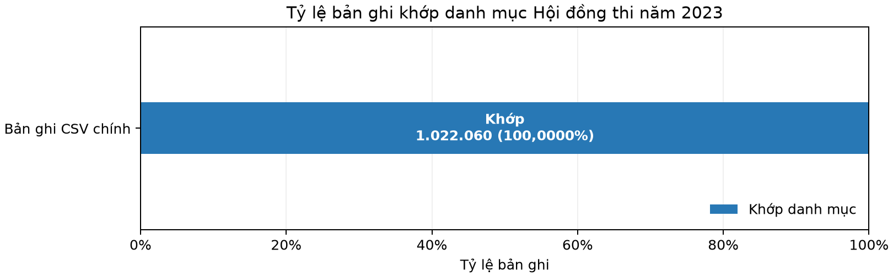

# INFO3020 Week 5 — Transformation, reduction & integration

**Bài tập:** EX5.1–EX5.3 · **Hạn:** 23:59 ngày trước buổi học Week 6  
**Câu hỏi nghiên cứu:** *Phân bố điểm thi THPT năm 2023 khác nhau thế nào giữa các Hội đồng thi, và tỷ lệ thiếu điểm cùng nhóm môn quan sát ảnh hưởng gì đến cách diễn giải?*

## Phạm vi và nguồn dữ liệu

Pipeline xử lý toàn bộ **1.022.060 bản ghi** của CSV dự án, không lấy mẫu. Tệp nguồn được giữ nguyên; SHA-256 là `cdf22a6b45f8e23b522beb1c521782e36486cac39d3fb64bca2a2395edec39b5`. Dữ liệu gốc có 11 cột: mã thí sinh, 9 điểm thi và mã Ngoại ngữ.

Nguồn bổ sung là danh mục **64 mã Hội đồng thi**. **63 mã và tên** được chép từ [bảng tra cứu năm 2023 của Báo Chính phủ](https://baochinhphu.vn/cach-tra-cuu-diem-thi-tot-nghiep-thpt-nam-2023-102230717160222763.htm); mã 1–9 được thêm số 0 đầu để khớp ID. **Mã 65** `Cục Nhà trường -Bộ Quốc phòng` bổ sung từ [Phụ lục VIII, Công văn 1515/BGDĐT-QLCL](https://hic.edu.vn/wp-content/uploads/2023/05/230407-1515_BGDDT_QLCL-HD-to-chuc-ky-thi-TN-THPT-nam-2023.pdf). Bản PDF này chỉ ghi tháng 4/2023 và để trống ngày ban hành, nên không suy đoán ngày. Ngày kiểm tra nguồn: **2026-09-24**. Mã 20 không có trong hai danh mục. Bảng trích 63 dòng có SHA-256 `5304a9c15a3f718ed1fbf91f7e972c021e35b4797ba5d33e05efea0d26728af8` và file ghép có SHA-256 `9c93850400d83a148a81de5879001ecafa0e26ba70b072000c7a0eec21cfb530`. Mã 33 có khác biệt cách viết giữa hai nguồn; file ghép dùng cách viết Báo Chính phủ. Xem [bảng trích gốc](week5_gov_table_excerpt+trich_bang_nguon.csv), [quy tắc ánh xạ](week5_source_mapping+anh_xa_nguon.md) và [bảng kiểm tra từng mã](../outputs/tables/week5_reference_source_check+doi_chieu_nguon_bo_sung.csv).

Quy tắc ghép lấy **hai ký tự đầu của Student ID** làm `exam_council_code`, theo [hướng dẫn cấu trúc số báo danh năm 2023](https://caodangsaigon.edu.vn/ky-thi-thpt-cdsg/huong-dan-cach-tra-so-bao-danh-thi-thpt-quoc-gia-2023/). Trong lần chạy, 63/63 mã riêng ở dữ liệu chính khớp danh mục. Tên Hội đồng thi theo mã không chứng minh nơi cư trú hay trường học của thí sinh.

## EX5.1 — Pipeline tiền xử lý

Pipeline gồm đọc và kiểm tra nguồn → chuẩn hóa chuỗi và kiểm tra mã → phát hiện/loại bản ghi trùng hoàn toàn (so trên cột gốc đã parse, giữ lần đầu) → kiểm tra ID xung đột và miền điểm → thống kê thiếu → tính cờ ngoại lệ → suy nhóm môn quan sát → ghép danh mục → ghi dữ liệu và kiểm tra round-trip. Nếu có ID xung đột, điểm ngoài 0–10, mã sai hoặc khóa nguồn trùng, pipeline dừng. **Không điền giá trị thiếu, không sửa/xóa ngoại lệ, không scale/encode/PCA.**

### Số dòng qua từng bước

| Bước | Dòng trước | Dòng sau | Loại | Phạm vi xét | Đổi | Kết quả |
| --- | --- | --- | --- | --- | --- | --- |
| 01_read_sources | 0 | 1.022.060 | 0 | 1.022.060 | 0 | Đọc CSV gốc và danh mục 2023; kiểm tra schema, hash, mã duy nhất. |
| 02_text_standardization | 1.022.060 | 1.022.060 | 0 | 1.022.060 | 0 | NFKC, strip, gộp whitespace; uppercase mã ngoại ngữ; kiểm tra mã sau chuẩn hóa. |
| 03_exact_duplicate_removal | 1.022.060 | 1.022.060 | 0 | 1.022.060 | 0 | Loại bản ghi trùng hoàn toàn sau lần xuất hiện đầu; xung đột ID làm pipeline dừng. |
| 04_audit_and_missing | 1.022.060 | 1.022.060 | 0 | 3.394.966 | 0 | Giữ null; xác thực ID, mã, miền điểm 0–10; phân nhóm ô thiếu cấu trúc ứng viên và chưa rõ. |
| 05_outlier_detection | 1.022.060 | 1.022.060 | 0 | 34.857 | 0 | Tính lại IQR/Z-score; cờ chỉ để điều tra, không sửa/xóa điểm. |
| 06_merge_exam_council | 1.022.060 | 1.022.060 | 0 | 1.022.060 | 0 | Left many-to-one merge; 1,022,060 khớp, 0 không khớp. |
| 07_roundtrip_validation | 1.022.060 | 1.022.060 | 0 | 1.022.060 | 0 | Đọc lại CSV, xác nhận schema, thứ tự, điểm, null, mã chuỗi và match count. |

**Cách đọc:** `Dòng trước/sau` là số bản ghi tại ranh giới của bước; `Loại` chỉ là dòng thật sự bị loại; `Phạm vi xét` có thể là số ô thiếu hoặc ô ngoại lệ, nên không phải lúc nào cũng là số thí sinh duy nhất. Các phạm vi có thể chồng lấp và không được cộng để suy ra số người khác nhau. `Đổi` đếm dòng bị loại hoặc có giá trị trong 11 cột gốc thay đổi; việc thêm cột ngữ cảnh được mô tả riêng, không tính là sửa giá trị gốc.

### Missing values — giữ thiếu, không suy đoán

| Cột gốc | Thiếu | Quan sát | Thiếu (%) | Quyết định |
| --- | ---: | ---: | ---: | --- |
| Student ID | 0 | 1.022.060 | 0,000% | Bắt buộc có; thiếu thì dừng |
| Mathematics | 18.687 | 1.003.373 | 1,828% | Giữ null |
| Literature | 13.821 | 1.008.239 | 1,352% | Giữ null |
| Foreign language | 141.063 | 880.997 | 13,802% | Giữ null |
| Physics | 694.871 | 327.189 | 67,987% | Giữ null |
| Chemistry | 693.942 | 328.118 | 67,896% | Giữ null |
| Biology | 697.435 | 324.625 | 68,238% | Giữ null |
| History | 338.613 | 683.447 | 33,130% | Giữ null |
| Geography | 339.926 | 682.134 | 33,259% | Giữ null |
| Civic education | 456.608 | 565.452 | 44,675% | Giữ null |
| Foreign language code | 141.063 | 880.997 | 13,802% | Giữ null |

**Cách tính:** `Thiếu (%) = số ô null trong cột / số dòng sau chính sách loại trùng × 100`. Null bị bỏ khỏi phép tính điểm, nhưng vẫn giữ nguyên trong file đầu ra. Tỷ lệ thiếu khác nhau giữa môn không khẳng định một nguyên nhân cụ thể; nhóm môn bên dưới chỉ suy từ điểm đang hiện diện.

| Nhóm điểm quan sát | Thí sinh | Ô điểm thiếu | Ứng viên thiếu cấu trúc | Chưa rõ nguyên nhân |
| --- | --- | --- | --- | --- |
| science_only | 329.430 | 1.019.435 | 988.290 | 31.145 |
| social_only | 683.813 | 2.307.861 | 2.051.439 | 256.422 |
| both_observed | 0 | 0 | 0 | 0 |
| neither_observed | 8.817 | 67.670 | 0 | 67.670 |

**Giải nghĩa nhóm thiếu:** `science_only` là có ít nhất một điểm Vật lý/Hóa học/Sinh học và không có điểm ở ba môn Lịch sử/Địa lý/GDCD; `social_only` định nghĩa ngược lại. `both_observed` có ít nhất một điểm ở cả hai nhóm; `neither_observed` không có điểm ở cả hai. Ở `science_only`, ô thiếu thuộc ba môn xã hội được **đánh dấu ứng viên thiếu cấu trúc**; ở `social_only`, ô thiếu thuộc ba môn tự nhiên cũng vậy. Đây là suy luận từ điểm hiện diện, **không xác nhận thí sinh đăng ký tổ hợp nào**. Mọi ô thiếu khác là `chưa rõ nguyên nhân`. Số ô thiếu = ứng viên cấu trúc + chưa rõ; các tổng đối chiếu với bảng thiếu theo cột. Chi tiết từng môn và nhóm: [`week5_missing_by_observed_group+thieu_theo_mon_va_nhom.csv`](../outputs/tables/week5_missing_by_observed_group+thieu_theo_mon_va_nhom.csv).

### Ngoại lệ thống kê

- **IQR:** Q1 và Q3 là phân vị 25%/75% nội suy tuyến tính; `IQR = Q3 − Q1`. Gắn cờ nếu `x < Q1 − 1,5×IQR` hoặc `x > Q3 + 1,5×IQR`.
- **Z-score:** `Z = (x − μ)/σ`, dùng độ lệch chuẩn tổng thể `ddof=0`; gắn cờ khi `|Z| > 3`.
- Tính riêng từng môn trên điểm quan sát; thiếu không tham gia phép tính. Cờ chỉ là tín hiệu điều tra, không phải phán quyết sai dữ liệu.

| Môn | Điểm quan sát | Ngưỡng IQR | Cờ IQR | Tỷ lệ | Ngưỡng Z-score | Cờ Z | Tỷ lệ | Cả hai | Hợp |
| --- | --- | --- | --- | --- | --- | --- | --- | --- | --- |
| Toán | 1.003.373 | 1.60000 – 11.20000 | 1.965 | 0,1958% | 1.35055 – 11.15056 | 371 | 0,0370% | 371 | 1.965 |
| Ngữ văn | 1.008.239 | 3.37500 – 10.37500 | 11.697 | 1,1601% | 2.87878 – 10.83760 | 5.598 | 0,5552% | 5.598 | 11.697 |
| Ngoại ngữ | 880.997 | -0.50000 – 11.50000 | 0 | 0,0000% | -0.43665 – 11.36147 | 0 | 0,0000% | 0 | 0 |
| Vật lý | 327.189 | 2.12500 – 11.12500 | 481 | 0,1470% | 2.11345 – 11.03435 | 481 | 0,1470% | 481 | 481 |
| Hóa học | 328.118 | 2.75000 – 10.75000 | 1.706 | 0,5199% | 2.45925 – 11.03004 | 985 | 0,3002% | 985 | 1.706 |
| Sinh học | 324.625 | 2.87500 – 9.87500 | 1.357 | 0,4180% | 2.77462 – 10.01524 | 1.222 | 0,3764% | 1.222 | 1.357 |
| Lịch sử | 683.447 | 1.62500 – 10.62500 | 270 | 0,0395% | 1.36684 – 10.68442 | 117 | 0,0171% | 117 | 270 |
| Địa lý | 682.134 | 3.25000 – 9.25000 | 6.627 | 0,9715% | 2.64133 – 9.65372 | 2.332 | 0,3419% | 2.332 | 6.627 |
| GDCD | 565.452 | 5.50000 – 11.50000 | 10.754 | 1,9018% | 4.87289 – 11.69871 | 5.492 | 0,9713% | 5.492 | 10.754 |

**Ý nghĩa số đếm:** `Cờ IQR`, `Cờ Z`, `Cả hai` và `Hợp` là số **ô điểm**, không phải số học sinh; `Hợp = IQR ∪ Z`. Có **34.857 ô điểm** thuộc hợp cờ, của **30.190 thí sinh khác nhau**. Tỷ lệ của từng môn dùng số điểm quan sát của chính môn đó làm mẫu số. Bảng đầy đủ có ngưỡng chưa làm tròn và cờ từng ô tại [`week5_outlier_comparison+so_sanh_ngoai_le.csv`](../outputs/tables/week5_outlier_comparison+so_sanh_ngoai_le.csv) và [`week5_outlier_details+chi_tiet_ngoai_le.csv`](../outputs/tables/week5_outlier_details+chi_tiet_ngoai_le.csv).

### Chuẩn hóa văn bản

Student ID và Foreign language code được đọc dạng chuỗi để giữ số 0 đầu. Quy tắc là Unicode NFKC, bỏ khoảng trắng đầu/cuối, gộp khoảng trắng liền nhau; mã ngoại ngữ được chuyển chữ hoa. ID phải khớp `[0-9]{8}`, mã ngoại ngữ phải thuộc N1–N7; giá trị sai không được tự đoán.

| Cột | Distinct trước | Distinct sau | Thiếu | Dòng đổi | Sai định dạng sau |
| --- | --- | --- | --- | --- | --- |
| Student ID | 1.022.060 | 1.022.060 | 0 | 0 | 0 |
| Foreign language code | 7 | 7 | 141.063 | 0 | 0 |

**Cách đếm:** distinct = số giá trị khác nhau, không tính null; thiếu được báo riêng. `Dòng đổi` so sánh giá trị trước/sau, trong đó hai null được xem là không đổi. Tổng cộng **0 dòng đổi** ở hai cột; đây là kết quả quan sát từ dữ liệu, không đặt biến thể giả để giảm distinct. Bảng lỗi định dạng (nếu có) ở [`week5_text_validation_issues+loi_dinh_dang_chuoi.csv`](../outputs/tables/week5_text_validation_issues+loi_dinh_dang_chuoi.csv).

## EX5.2 — Ghép nguồn danh mục Hội đồng thi

Chuẩn hóa khóa `(exam_year=2023, exam_council_code=Student ID[:2])`; ghép trái bằng `validate="many_to_one"` và `indicator=True`. Khóa bên danh mục phải duy nhất. Ghép trái bảo đảm giữ thí sinh không khớp để có thể đối soát; trường tên để trống và `merge_status=left_only`.

### Kết quả ghép

Mỗi phép `merge` in `len(df)` ngay trước và sau khi thực hiện. Ba phép đầu đối soát nguồn/khóa; phép cuối tích hợp dữ liệu thí sinh. Nhật ký đầy đủ: [`week5_merge_operations+nhat_ky_phep_ghep.csv`](../outputs/tables/week5_merge_operations+nhat_ky_phep_ghep.csv).

| Phép ghép | Dòng trước | Dòng bên phải | Dòng sau | Kiểu | Kiểm tra khóa |
| --- | --- | --- | --- | --- | --- |
| reference_source_check | 64 | 63 | 64 | left | one_to_one |
| distinct_key_check | 63 | 64 | 63 | left | one_to_one |
| key_candidate_counts | 63 | 63 | 63 | inner | one_to_one |
| exam_council_integration | 1.022.060 | 64 | 1.022.060 | left | many_to_one |

| Chỉ số | Kết quả | Cách hiểu |
| --- | --- | --- |
| Dòng bảng chính trước ghép | 1.022.060 | Mẫu số tính match rate theo dòng. |
| Dòng danh mục nguồn | 64 | Bảng khóa mã và tên của năm 2023. |
| Khóa mã riêng ở dữ liệu chính | 63 | Cặp (năm, mã) riêng biệt có trong ID. |
| Khóa trùng bên danh mục | 0 | Phải bằng 0 để validate many_to_one. |
| Số dòng sau ghép | 1.022.060 | Phải bằng số dòng trước ghép. |
| Dòng khớp / không khớp | 1.022.060 / 0 | matched + left_only phải bằng tổng dòng. |
| Match rate theo dòng | 100,0000% | Matched rows / main rows × 100. |
| Match rate theo khóa | 100,0000% | Mã riêng ghép được / tổng mã riêng × 100. |
| Mã danh mục chưa dùng | 1 | 65 — Cục Nhà trường -Bộ Quốc phòng |

**Công thức:** match rate theo dòng = `số dòng matched / số dòng bảng chính trước merge × 100%`; match rate theo khóa = `số khóa riêng (năm, mã) khớp / số khóa riêng hợp lệ ở bảng chính × 100%`. Hai tỷ lệ dùng mẫu số khác nhau. `many_to_one` ngăn một mã nguồn làm nhân số dòng; `indicator` ghi trạng thái khớp. Kết quả ghép thực tế là **100,0000% theo dòng** và **100,0000% theo khóa**; sau ghép giữ **1.022.060 dòng**. Không khớp: Không có khóa không khớp.



**Cách đọc biểu đồ:** đây là thanh ngang xếp chồng 100%; trục ngang là tỷ lệ bản ghi, xanh là khớp và cam là không khớp. Nhãn ghi số dòng cùng tỷ lệ trong mỗi nhóm. Biểu đồ cho thấy độ phủ của danh mục mã, không đo độ chính xác của điểm thi.

## EX5.3 — Dữ liệu bàn giao và khả năng tái lập

Dữ liệu cuối [`week5_final+du_lieu_cuoi.csv`](../data/processed/week5_final+du_lieu_cuoi.csv) gồm **1.022.060 dòng, 16 cột** theo đúng thứ tự:

`Student ID, Mathematics, Literature, Foreign language, Physics, Chemistry, Biology, History, Geography, Civic education, Foreign language code, exam_year, exam_council_code, exam_council_name, observed_exam_group, merge_status`

11 cột gốc được giữ nguyên (ngoại trừ chuẩn hóa khoảng trắng/Unicode/chữ hoa nếu phát sinh); bổ sung năm thi, mã/tên Hội đồng thi, nhóm điểm tổ hợp quan sát và trạng thái ghép. Cột `observed_exam_group` nhận `science_only`, `social_only`, `both_observed` hoặc `neither_observed`; tên gọi mô tả **điểm đang có trong CSV**, không phải đăng ký môn. Điểm 0, điểm thiếu và ngoại lệ chưa xác minh tiếp tục giữ nguyên.

Cleaning Log tổng hợp **43 quyết định** Week 3–5. 35 dòng đầu là bản chụp nhật ký Week 3–4 đã dựng từ bằng chứng hiện có; ngày gốc chưa rõ được để trống. Các cột `scope_rows` và `changed_rows` lần lượt phân biệt số bản ghi/ô thuộc phạm vi xét với số dòng thực sự đổi. Các quyết định mới của Week 5:

| ID | Cột / bản ghi | Vấn đề | Quyết định | Lý do | Phạm vi | Đổi |
| --- | --- | --- | --- | --- | --- | --- |
| CL036 | Toàn bộ bản ghi | Bản ghi trùng hoàn toàn | Không loại; không có dòng trùng hoàn toàn | Tránh đếm lặp một bản ghi y hệt; hiện trạng được xác nhận bằng quét toàn bộ 11 cột. | 1.022.060 | 0 |
| CL037 | 9 cột điểm | Giá trị điểm thiếu | Giữ null | CSV không cung cấp điểm thay thế; ô thiếu có thể liên quan lựa chọn môn nhưng không xác nhận từng trường hợp. | 3.394.966 | 0 |
| CL038 | 9 cột điểm | Ngoại lệ thống kê | Gắn cờ để điều tra; giữ điểm | Cờ IQR/Z-score không chứng minh nhập sai; các quyết định sửa điểm cần đối chứng độc lập. | 34.857 | 0 |
| CL039 | Student ID | Chuẩn hóa chuỗi | Chuẩn hóa; không sửa nếu đã đạt quy tắc | Giữ ID dạng chuỗi và không suy đoán giá trị; mã ngoại ngữ dùng chữ hoa. | 1.022.060 | 0 |
| CL040 | Foreign language code | Chuẩn hóa chuỗi | Chuẩn hóa; không sửa nếu đã đạt quy tắc | Giữ ID dạng chuỗi và không suy đoán giá trị; mã ngoại ngữ dùng chữ hoa. | 1.022.060 | 0 |
| CL041 | Student ID → mã Hội đồng thi | Ghép nguồn địa phương năm 2023 | Left join; giữ dòng không khớp và để tên thiếu | Không fuzzy-match; 63 tên từ Báo Chính phủ năm 2023 và mã 65 từ Phụ lục VIII. Kết quả: 1,022,060 dòng khớp, 0 dòng không khớp. | 1.022.060 | 0 |
| CL042 | observed_exam_group | Gắn nhóm theo điểm tổ hợp quan sát | Thêm biến ngữ cảnh; không sửa bản ghi nguồn | Nhóm chỉ phản ánh điểm nào đang quan sát được; không khẳng định hồ sơ đăng ký thi. | 1.022.060 | 0 |
| CL043 | Điểm và ô thiếu | Không biến đổi điểm, không điền thiếu | Bảo toàn dữ liệu gốc sau chuẩn hóa mã; xuất riêng cột nguồn | Giữ đơn vị 0–10 để EDA; tránh tạo giá trị không có căn cứ hoặc leakage. | 1.022.060 | 0 |

### Chạy lại

Tại thư mục gốc trong PowerShell:

```powershell
& .venv/Scripts/python.exe src/main.py
```

Lệnh đọc hai tệp trong `data/raw`, kiểm tra hash và schema, tạo CSV đã xử lý, các bảng kiểm tra, Cleaning Log, manifest, biểu đồ, báo cáo Markdown Week 5 riêng và notebook Week 5 đã chạy. Không phụ thuộc vào dữ liệu `processed`, metrics hoặc bảng kết quả Week 3–4; nhật ký lịch sử Week 3–4 được lưu thành nguồn đầu vào có phiên bản tại [`week5_prior_decisions+quyet_dinh_tuan_truoc.csv`](week5_prior_decisions+quyet_dinh_tuan_truoc.csv).

Manifest [`week5_manifest+ho_so_dau_ra.json`](../outputs/week5_manifest+ho_so_dau_ra.json) lưu hash, thông số và phiên bản môi trường. Kiểm tra đọc lại CSV xác nhận schema, số dòng, thứ tự ID, mã chuỗi có số 0 đầu, điểm và mặt nạ null; SHA-256 dùng để đối chiếu nội dung file giữa các lần chạy. Bảng tóm tắt nhật ký pipeline: [`week5_pipeline_log+nhat_ky_quy_trinh.csv`](../outputs/tables/week5_pipeline_log+nhat_ky_quy_trinh.csv). [Từ điển dữ liệu Week 5](week5_data_dictionary+tu_dien_du_lieu.md) và [bảng CSV tương ứng](../outputs/tables/week5_data_dictionary+tu_dien_du_lieu.csv) giải thích từng cột.

Khi chuyển sang mô hình dự đoán, phải chia train/test trước; mọi bước học tham số từ dữ liệu như scaling hoặc encoding chỉ được `fit` trên train hoặc trong từng fold. Dataset Week 5 hiện giữ đơn vị điểm gốc để phục vụ EDA, không đưa phép biến đổi học từ toàn bộ tập vào đây.

## Câu hỏi nghiên cứu và giới hạn

Chênh lệch điểm giữa Hội đồng thi chỉ là so sánh phân bố mô tả; không được diễn giải thành chênh lệch năng lực địa phương hay tác động của chất lượng trường. Thành phần thí sinh, môn lựa chọn, thiếu dữ liệu, trường học và điều kiện tổ chức có thể khác nhau nhưng chưa có trong hai nguồn. Tuần 6 cần báo cáo mẫu số theo môn, nhóm và Hội đồng thi; tuần 7 chọn biểu đồ phù hợp; mọi nhận định phải nêu phạm vi dữ liệu hỗ trợ.

Tệp chính và bảng nguồn có thể được đối chiếu trực tiếp bằng hash tại manifest. Bảng các mã không dùng nằm ở [`week5_unused_reference_codes+ma_nguon_chua_dung.csv`](../outputs/tables/week5_unused_reference_codes+ma_nguon_chua_dung.csv); khóa không khớp ở [`week5_unmatched_keys+khoa_khong_khop.csv`](../outputs/tables/week5_unmatched_keys+khoa_khong_khop.csv).
